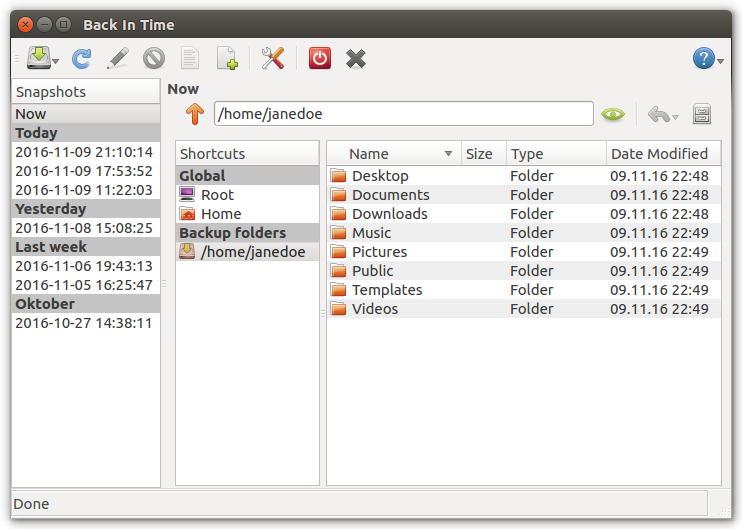

.. Back In Time documentation master file, created by
   sphinx-quickstart on Sun Mar 20 20:28:50 2016.
   You can adapt this file completely to your liking, but it should at least
   contain the root `toctree` directive.

Welcome to Back In Time's documentation!
========================================

Contents:
+++++++++

.. toctree::
    :maxdepth: 2

    mainwindow
    settings
    snapshotsdialog
    log

------------

Introduction
++++++++++++

Back In Time is a simple backup solution for Linux Desktops. It is based on
``rsync`` and uses hard-links to reduce space used for unchanged files.
It comes with a Qt4 GUI which will run on both Gnome and KDE based Desktops.
Back In Time is written in Python3 and is licensed under GPL2.
