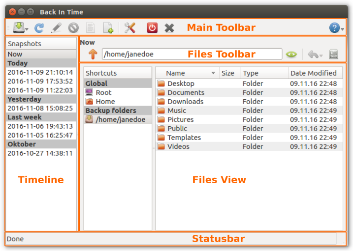

Main Window
===========

Overview
++++++++

Main Toolbar
++++++++++++

|take_snapshot| Take Snapshot
    Take a new Snapshot in background. The main window can be closed during
    taking the snapshot. Normal behavior is to only compare files size and
    modification time. Alternatively, you can take a new Snapshot with
    ``checksums`` option enabled. This will calculate checksums for every
    file to decide if the file has changed. Taking a snapshot with checksums
    option takes a lot more time but it will make sure, the destination files
    won't be corrupt.

|refresh_snapshot| Refresh Snapshots List
    Refresh the Snapshots in `Timeline`_.

|snapshot_name| Snapshot Name
    Add a name for a Snapshot so you can easily identify it later.
    If ``Don't remove named snapshots`` in
    :menuselection:`Settings --> Auto Remove` is enabled this will also prevent
    the Snapshot from being removed.

    If this button is grayed out you need to select a snapshot in `Timeline`_.

|remove_snapshot| Remove Snapshot
    Remove one or more Snapshots from Timeline. ``Now`` can not be removed as
    this is no Snapshot but the live view of the local file-system.

    If this button is grayed out you need to select a snapshot in `Timeline`_.

|view_snapshot_log| View Snapshot Log
    View the log of the selected Snapshot.

    If this button is grayed out you need to select a snapshot in `Timeline`_.

|view_last_log| View Last Log
    View the log from the last snapshot attempt.

|settings| Settings
    Open :doc:`/settings`.

|shutdown| Shutdown System after Snapshot has finished
    Shutdown the computer and poweroff after a snapshot has finished.
    The main window must stay open for this. If shutdown is not supported on
    the system this button will be grayed out.

|exit| Exit
    Close the main window. Running Snapshots will remain in background.

|help| Help
    Menu with links to this help, FAQ, report bugs...

Files Toolbar
+++++++++++++

.. |up|             image:: _images/go-up_btn.svg

|up| Up
    Go to the parent folder.

|show_hidden| Show hidden files
    Toggle hidden files (starting with a dot) to be shown in files view.

|restore| Restore
    Restore selected files or folders. This button has a sub-menu (hold down
    the button). Default action is ``Restore``.

    If this button is grayed out you need to select a snapshot in `Timeline`_.

    |restore| Restore
        Restore the selected files or folders to the original destination.

    |restore_to| Restore to...
        Restore the selected files or folders to a new destination.

    |restore| Restore '/path'
        Restore the currently shown folder and all its content to the original
        destination.

    |restore_to| Restore '/path' to...
        Restore the currently shown folder and all its content to a new
        destination.

|snapshots| Snapshots
    Open :doc:`/snapshotsdialog`.

Timeline
++++++++

The Timeline lists all Snapshots which where already taken. You can browse them
to see its contents in right hand `Files View`_. The first item ``Now`` is not
a Snapshot. It is a live view on the local file-system. It shows exact the same
as your normal file browser. Multi selection is possible to remove multiple
Snapshots altogether.

Files View
++++++++++
Depending on selection in left hand `Timeline`_ this will either show the
original files or the files in the selected snapshot. You can jump directly to
your home or include folders in ``Shortcuts``.

Statusbar
+++++++++

Show current status. While a snapshot is running this will show a progress-bar
combined with current speed, already transfered data and the last message from
``rsync``.
