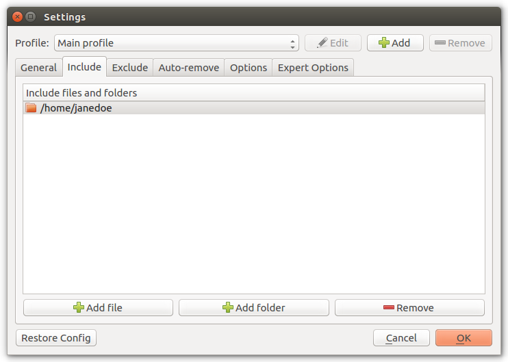

Settings
========

General
+++++++

Local
-----

.. image:: _images/settings_general.png
    :target: _images/settings_general.png
    :alt:    Settings - General

Local Encrytped
---------------

SSH
---

SSH Encrypted
-------------

.. image:: _images/settings_general_ssh_encrypted.png
    :target: _images/settings_general_ssh_encrypted.png
    :alt:    Settings - General

Schedule
--------

Include
+++++++

Exclude
+++++++

Auto Remove
+++++++++++

.. image:: _images/settings_autoremove.png
    :target: _images/settings_autoremove.png
    :alt:    Settings - Auto Remove

Options
+++++++

.. image:: _images/settings_options.png
    :target: _images/settings_options.png
    :alt:    Settings - Options

Expert Options
++++++++++++++

.. image:: _images/settings_expert_options.png
    :target: _images/settings_expert_options.png
    :alt:    Settings - Expert Options
