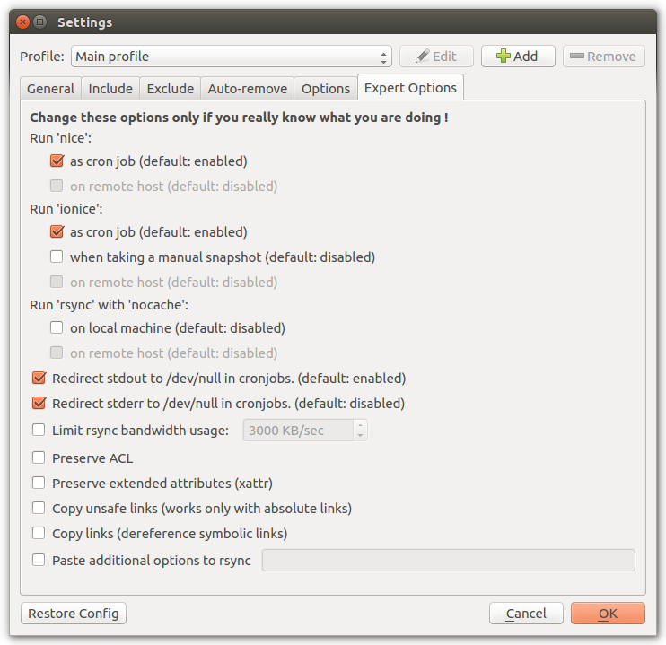

Settings
========

Profile
+++++++

General
+++++++

You can choose which mode `Back in Time` should use to store snapshots.

Available modes:

- `Local`_
- `Local Encrypted`_
- `SSH`_
- `SSH Encrypted`_

Local
-----

Local snapshots can be stored on internal or external hard-drive or on mounted
shares. The destination file-system must support hard-links. Also the protocol
used to mount the remote share must support hard-links and symlinks. By default
Samba (SMB/CIFS) servers doesn't support symlinks (can be activated with
``follow symlinks = yes`` and ``wide links = yes`` in ``/etc/samba/smb.conf``).
`sshfs` mounted shares doesn't support hard-links.

Choose the destination path for snapshots with the |folder| `Folder` button.
`Back in Time` will create sub-folders ``backintime/<HOST>/<USER>/<PROFILE>/``
inside that folder. Snapshots will be placed inside the ``<PROFILE>/``
folder.

Local Encrypted
---------------

`Local Encrypted`_ works like `Local`_ but the snapshots will be stored
encrypted with ``EncFs``. The encrypted folder will be created automatically
inside the selected folder.

**Warning:** A recent security audit revealed several possible attack vectors
for ``EncFs``.

From https://defuse.ca/audits/encfs.htm:

    EncFS is probably safe as long as the adversary only gets one copy of
    the ciphertext and nothing more. EncFS is not safe if the adversary has
    the opportunity to see two or more snapshots of the ciphertext at
    different times. EncFS attempts to protect files from malicious
    modification, but there are serious problems with this feature.

This might be a problem with Back In Time snapshots.

.. image:: _images/settings_general_local_encrypted.png
    :target: _images/settings_general_local_encrypted.png
    :alt:    Settings - General

Enter the password for ``EncFs`` in ``Encryption``. The password can be stored
in users keyring. The keyring is unlocked with the users password during login.
When running a scheduled backup-job while the user is not logged in the keyring
is not available. For this case, the password can be cached in memory by
`Back in Time`.

SSH
---

This mode will store snapshots on a remote host which is available through
``SSH``. It will run ``rsync`` directly on the remote host which makes it a lot
faster than syncing to a local mounted share.

In order to use this mode the remote host need to be in your ``known_hosts``
file. You need to have a public/private SSH key pair installed on the remote
host. Starting with `Back in Time` version 1.2.0 this will be done
automatically. For versions lower than 1.2.0 you need to do this manually:

- if you did not login into the remote host before you need to run ``ssh
  USER@HOST`` in Terminal. You will be asked to confirm the fingerprint of the
  remote host-key with ``yes``. In order to compare the host-key you need to
  login to the remote host locally and run ``ssh-keygen -l -f
  /etc/ssh/ssh_host_ecdsa_key.pub``. The fingerprint from this output must match
  the fingerprint you got asked above. You can exit immediately after this.

- generate a new public/private SSH key with ``ssh-keygen``. Press :kbd:`Enter`
  to accept the default path and enter a password for the new key (this has
  nothing to do with your user-password on the remote host).

- run ``ssh-copy-id -i ~/.ssh/id_rsa.pub USER@HOST`` to install the newly
  created key on the remote host. For the last time you need to enter the login
  password for the remote user. If successful you should now be able to log in
  without being asked for your login password.

.. image:: _images/settings_general_ssh.png
    :target: _images/settings_general_ssh.png
    :alt:    Settings - General

Enter the name or IP-address of the remote host in ``Host`` and the port of the
remote SSH-server in ``Port`` (default ``22``). ``User`` need
to be the remote user. ``Path`` can be empty to place the snapshot folder
directly into remote users home folder. Relative paths without leading slash
(``foo/bar/``) will be sub-folders of users home. Paths with leading
slash (``/mnt/foo/bar/``) will be absolute.

In ``Cipher`` you can choose the cipher (algorithm used to encrypt) for SSH
transfer. Depending on the involved systems it could be faster to select a
different cipher than default. Some of them might not work because they are
known to be insecure. You can run ``backintime benchmark-cipher`` to compare
transfer speed of all ciphers.

In ``Private Key`` you need to select your private SSH key. If this does not yet
exist, you can create a new public/private SSH key without password by clicking
on |add|

Enter the private key password in ``SSH private key`` (this is the password you
chose above during creating the public/private key pair, not the login password
for the remote user). The password can be stored in users keyring. The keyring
is unlocked with the users password during login. When running a scheduled
backup-job while the user is not logged in, the keyring is not available. For
this case, the password can be cached in memory by `Back in Time`.

SSH Encrypted
-------------

`SSH Encrypted`_ will work like `SSH`_ but the snapshots will be stored
encrypted using ``encfs --reverse``. `Back in Time` will mount an encrypted view
of the local root file-system (``/``) and sync it with ``rsync`` to the remote
host. As `Back in Time` will backup the encrypted files, all logs and status
messages will show cypher text.

**Warning:** A recent security audit revealed several possible attack vectors
for ``EncFs``.

From https://defuse.ca/audits/encfs.htm:

    EncFS is probably safe as long as the adversary only gets one copy of
    the ciphertext and nothing more. EncFS is not safe if the adversary has
    the opportunity to see two or more snapshots of the ciphertext at
    different times. EncFS attempts to protect files from malicious
    modification, but there are serious problems with this feature.

This might be a problem with Back In Time snapshots.

Additional to those settings from `SSH`_ you need to provide a password for
encryption.

Advanced
--------

``Host``, ``User`` and ``Profile`` will be filled automatically (must not be
empty). They are used for the snapshot path
``backintime/<HOST>/<USER>/<PROFILE>/``. The full snapshot path will be shown
below. You can change them to match paths from other machines.

Schedule
--------

Include
+++++++

.. image:: _images/settings_include.png
    :target: _images/settings_include.png
    :alt:    Settings - Include

Exclude
+++++++

.. image:: _images/settings_exclude.png
    :target: _images/settings_exclude.png
    :alt:    Settings - Exclude

Auto Remove
+++++++++++

Options
+++++++

Expert Options
++++++++++++++

