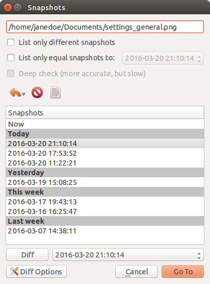

Snapshots Dialog
================

List only different Snapshots
    If checked only Snapshots with different file versions will be shown below.

List only equal Snapshots to
    If checked only Snapshots with file versions equal to the Snapshot
    on the right will be shown below.

Deep check
    Calculate checksums to decide if file versions are equal or different with
    ``List only different Snapshots`` or ``List only equal Snapshots to``.
    This takes a lot more time but is more accurate, too.

Restore
    Restore the file/folder from the selected Snapshot. Will be grayed out
    if ``Now`` or multiple Snapshots are selected.

Delete
    Delete the file/folder from one or multiple selected Snapshots. Will be
    grayed out if ``Now`` is selected.

Select All
    Select all Snapshots except ``Now``.

Snapshots
    Lists all Snapshots which contain the file/folder. Can be filtered with
    ``List only different Snapshots`` or ``List only equal Snapshots to``.

Diff
    Open a Side-by-Side view of the file/folder in the Snapshot above and
    the Snapshot in the right hand selection.

Diff Options
    Change the Program which is used for the Side-by-Side view with ``Diff``.
    You can use ``%1`` and ``%2`` for the paths of both Snapshots.

Go To
    Return to the Main Window and show the file in the above selected Snapshot.
